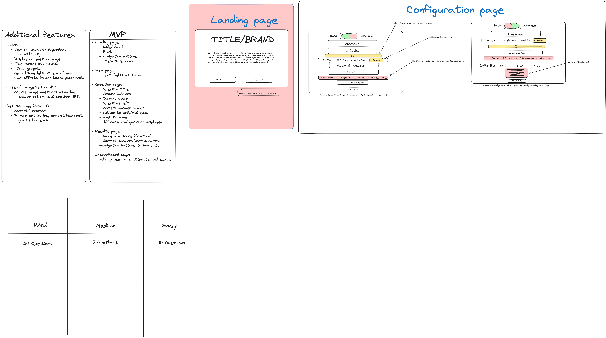

# < ReacTrivia /> Quiz Generator

## Overview
This group project serves to showcase our work in creating an application for users to play trivia games, covering different categories, and track their highscores. 

Our motivation for development was to provide a site offering dynamically generated and engaging quizzes for users to test their trivia knowledge. 

**User Story:**

AS A trivia enthusiast\
I WANT to play quiz games\
SO THAT I can have fun & test my general knowledge

## Access

To view this project, the deployed site can be found hosted on Netlify at: https://reac-trivia.netlify.app/

## Features

1. **Interactive Particle Background:**
   - Floating particles interact with user's mouse movement/inputs.

2. **Loading screen**
   - Visual and dynamic loading screen to inform the user that the app is being loaded to prevent users from unnecessarily leaving the site.

3. **Dynamic and fun Logo design:**
   - Logo design that is dynamic and is typed onto page using Typed.js npm package. Adds an interesting element to the quiz game.

4. **Vibrant and cohesive colour scheme:**
   - a bright and contrasted colour theme, fitting the style of an entertainment/game app, enhances the users experience.

5. **Customisable Quiz Form :**
   - The user is prompted to select their preferred settings for the quiz allowing them to take control.

6. **Animated button selection:**
   - The quiz answer buttons animate on click allowing the user to know which answer is selected and creates a dynamic feel to the app.

7. **Quiz summary/results display:**
   - Simple and easy to follow results section allowing the user to know thier score, and how many answers were incorrect and correct.

8. **Highscore page:**
   - A page which saves and displays local Quiz game results allowing the end user to keep track of their progress and highscore.

## Installation & Setup

Follow these steps to install and use this application:

1. **Prerequisites:**\
   To use and run this application, ensure that Node.js and npm (as well as Git) are installed locally.
   
3. **Fork & clone this repository:**\
   ` git clone https://github.com/nasinghw/ReacTrivia.git`
   
4. **Navigate to the project directory in your terminal:**\
   ` cd ReacTrivia`

5. **Install the necessary dependencies:**\
   ` npm install`
   
6. **Run the application in development mode in your browser:**\
   ` npm run dev`
  
   Follow the link that is highlighted: e.g" http://localhost:3000/"

## Technologies/Resources Used

**Front-End Technologies:**

- HTML, CSS, JavaScript.
- [React](https://react.dev/) - JavaScript library that's used for building reactive websites.
- [node.js](https://nodejs.org/en) - JavaScript runtime environment.
- [Vite](https://vitejs.dev/) - Vite is a local development server.

**npm Packages:**

- [TailwindCSS](https://tailwindcss.com/) - A utility-first CSS framework.
- [Axios](https://axios-http.com/docs/intro) - Axios is a promise-based HTTP Client for node.js and the browser.
- [React Router](https://reactrouter.com/en/main) - React Router enables "client side routing".
- [React-typed](https://www.npmjs.com/package/react-typed) - React wrapper for Typed.js Library.
- [tsParticles](https://www.npmjs.com/package/tsparticles) - Easily create highly customizable JavaScript particles effects.

find packages at [npmjs.com](https://www.npmjs.com/)

**APIs:**

- [The Trivia API](https://the-trivia-api.com/) - Used for returning quiz quiestions using user's input parameters.

## Initial Wireframe design

## Collaborators
**Narinder Singh:**
  GitHub: [nasinghw](https://github.com/nasinghw/)
 

**Arfin Tajammal:**
  GitHub: [Arfinxx](https://github.com/Arfinxx/)
 

**Alexander Flaherty:**
  GitHub: [Pazoraf](https://github.com/Pazoraf/)
 

**Roberto Medeiros:**
  GitHub: [rober-web](https://github.com/rober-web/)
 

**Thomas Airey:**
  GitHub: [aireytf](https://github.com/aireytf/)
 

**Udegbunam Chukwuemeka:**
  GitHub: [emeka-egbuna](https://github.com/emeka-egbuna)
 

## Credits 

**Sources referred to during development:**
 - Stack overflow
 - W3Schools
 - MDN Web Docs

